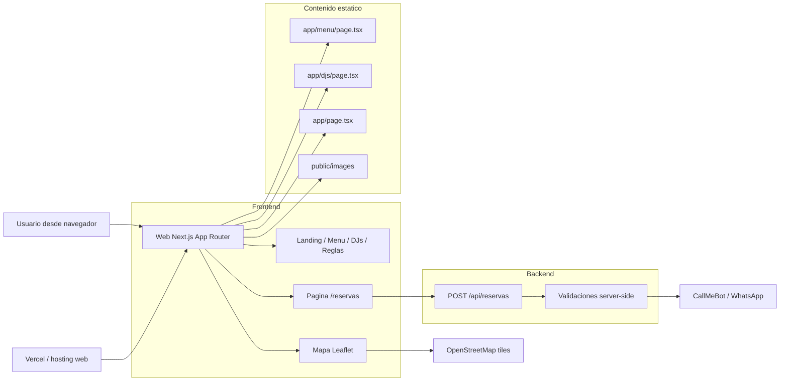
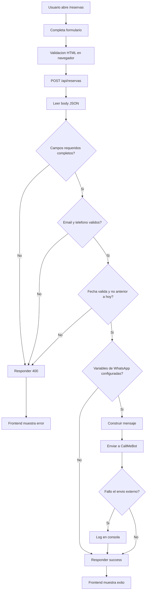

# La Combi Bar

Sitio web de La Combi Bar construido con Next.js para mostrar la propuesta del local, publicar la carta, visibilizar eventos/DJs y recibir reservas desde la web.

El proyecto esta orientado a una web comercial simple, con contenido mayormente estatico y una API ligera para procesar reservas. Hoy la notificacion principal de reservas se realiza via WhatsApp usando CallMeBot.

## Objetivo del proyecto

Este repositorio busca resolver tres necesidades principales del bar:

- presentar la marca y la propuesta del local
- publicar la carta y sus valores
- recibir solicitudes de reserva desde un formulario web

## Estado actual

Actualmente la aplicacion incluye:

- landing principal en `/`
- pagina de carta en `/menu`
- formulario de reservas en `/reservas`
- pagina de reglas del local en `/reglas`
- pagina de DJs en `/djs`
- endpoint `POST /api/reservas`
- `robots.txt`, `sitemap.xml` y metadata SEO
- mapa del local con Leaflet y OpenStreetMap

No existe base de datos ni panel administrativo. La mayor parte del contenido esta definida directamente en archivos `.tsx`.

## Stack tecnologico

- Next.js 15.1.12
- React 19
- TypeScript 5
- Tailwind CSS 3
- Leaflet
- OpenStreetMap
- API Route de Next.js para reservas
- CallMeBot / WhatsApp para notificaciones opcionales

## Arquitectura general



## Flujo de reservas

El flujo actual de reservas funciona de la siguiente manera:

1. El usuario entra a la web y abre `/reservas`.
2. Completa nombre, email, telefono, fecha, hora, cantidad de personas y comentarios opcionales.
3. El navegador aplica validaciones basicas HTML.
4. El frontend envia un `POST` a `/api/reservas`.
5. La API valida campos requeridos, formato de email, formato de telefono y fecha.
6. Si existen las variables de entorno de WhatsApp, la API construye un mensaje y lo envia a CallMeBot.
7. El frontend muestra exito o error generico al usuario.

### Diagrama de flujo de reserva



## Estructura del proyecto

```text
laCombiBar/
|-- app/
|   |-- api/reservas/route.ts
|   |-- djs/page.tsx
|   |-- layout.tsx
|   |-- menu/page.tsx
|   |-- page.tsx
|   |-- reglas/page.tsx
|   |-- reservas/page.tsx
|   |-- robots.ts
|   `-- sitemap.ts
|-- components/
|   |-- layout/
|   |   |-- Footer.tsx
|   |   `-- Header.tsx
|   |-- Map.tsx
|   `-- MapWrapper.tsx
|-- docs/
|   |-- GOOGLE_APPS_SCRIPT.md
|   `-- imagenes y material de referencia
|-- public/
|   `-- images/
|       `-- laCombiBar-logo.jpeg
|-- DESIGN.md
|-- AGENTS.md
|-- next.config.js
|-- package.json
|-- tailwind.config.js
`-- tsconfig.json
```

## Rutas disponibles

| Ruta | Descripcion |
|---|---|
| `/` | Landing principal del bar |
| `/menu` | Carta del local |
| `/reservas` | Formulario de reservas |
| `/reglas` | Reglas y normas del local |
| `/djs` | DJs y eventos destacados |
| `/api/reservas` | API para enviar reservas |
| `/robots.txt` | Reglas para indexacion |
| `/sitemap.xml` | Sitemap SEO |

## Modulos principales

### Landing

- presenta la marca, el CTA principal y la ubicacion
- enlaza a reservas, carta y redes sociales
- integra el mapa del local

### Carta

- contiene la oferta visible del bar en una pagina estatica
- hoy esta definida en `app/menu/page.tsx`
- la carta actual fue ajustada a partir de imagenes de referencia almacenadas en `docs/`
- incluye la cerveza trabajada por el local: `Trilogia del Sur`

### Reservas

- formulario simple de una sola pantalla
- datos requeridos: nombre, email, telefono, fecha, hora y personas
- comentarios opcionales
- el backend no guarda reservas en una base de datos

### DJs

- pagina de promocion de artistas o invitados
- contenido estatico en codigo

### SEO

- metadata con Open Graph y Twitter Cards
- `robots.ts`
- `sitemap.ts`
- JSON-LD tipo `Restaurant`

## Variables de entorno

El archivo `.env.example` documenta la configuracion actual:

```env
WHATSAPP_API_URL=https://api.callmebot.com/whatsapp.php
WHATSAPP_PHONE=56995291228
WHATSAPP_API_KEY=
```

### Que hace cada variable

- `WHATSAPP_API_URL`: URL base del servicio CallMeBot
- `WHATSAPP_PHONE`: numero destino para recibir la notificacion
- `WHATSAPP_API_KEY`: API key entregada por CallMeBot

## Instalacion y ejecucion local

### Requisitos

- Node.js 18.18+ o superior
- npm

### Pasos

```bash
npm install
npm run dev
```

La aplicacion quedara disponible en `http://localhost:3000`.

### Otros comandos utiles

```bash
npm run build
npm start
npm run lint
```

## Configuracion de despliegue

El proyecto esta listo para desplegarse en plataformas compatibles con Next.js, especialmente Vercel.

Consideraciones actuales:

- `next.config.js` usa `images.unoptimized = true`
- el `baseUrl` SEO esta configurado como `https://la-combi-bar.vercel.app`
- `.gitignore` excluye `.next`, `.vercel` y archivos de entorno

## Fuentes de contenido

El contenido actual proviene de distintas fuentes dentro del repositorio:

- `app/page.tsx`: contenido principal de la landing
- `app/menu/page.tsx`: carta y precios
- `app/djs/page.tsx`: DJs y enlaces sociales
- `public/images/`: branding y logo
- `docs/`: material de apoyo, referencias y documentacion adicional

## Limitaciones actuales

Estas son las principales limitaciones detectadas en el estado actual del repositorio:

- no existe persistencia de reservas en base de datos
- si falla el envio a WhatsApp, la API puede responder exito igualmente
- no hay validacion de disponibilidad real de mesas o aforo
- no hay panel de administracion para editar carta, horarios o eventos
- la carta y el contenido estan hardcodeados en el frontend
- no existe suite automatizada de pruebas
- no hay confirmacion por email ni seguimiento del estado de una reserva
- la verificacion de Google en metadata sigue con un valor placeholder

## Posibles mejoras y propuestas de desarrollo

### 1. Persistencia real de reservas

- guardar reservas en una base de datos
- agregar estados como `pendiente`, `confirmada`, `cancelada`
- registrar fecha de creacion y trazabilidad

### 2. Confirmaciones y operacion

- enviar confirmacion por email o WhatsApp al cliente
- crear vista interna para revisar reservas del dia
- agregar reintentos o cola para integraciones externas

### 3. Disponibilidad y reglas de negocio

- validar horarios reales del local
- limitar cupos por franja horaria
- evitar sobreventa de mesas
- separar reservas grandes (`9+`) para aprobacion manual

### 4. Gestion de contenido

- mover carta, DJs y eventos a un CMS o panel propio
- permitir cambios sin editar codigo
- versionar promociones y cartas por temporada

### 5. Observabilidad y seguridad

- agregar rate limiting al endpoint de reservas
- incluir captcha o mitigacion anti-spam
- registrar errores con una herramienta de monitoreo
- mejorar manejo de datos personales en integraciones externas

### 6. Calidad tecnica

- agregar tests unitarios e integracion del flujo de reservas
- tipar contenido con esquemas compartidos
- separar mejor datos, presentacion y logica

### 7. Producto y experiencia

- integrar calendario de eventos
- mejorar el mapa con indicaciones o enlaces directos
- optimizar accesibilidad, mensajes de error y feedback del formulario
- sumar analitica para medir clics, reservas y conversion

## Documentacion relacionada

- `DESIGN.md`: lineamientos visuales y decisiones de diseno
- `docs/GOOGLE_APPS_SCRIPT.md`: alternativa para guardar reservas en Google Sheets
- `docs/`: imagenes y material de referencia del negocio

## Recomendacion de evolucion

Si el objetivo es profesionalizar el flujo de reservas, el siguiente paso mas valioso no es visual sino operativo:

1. persistir la reserva en una base de datos
2. confirmar recepcion al usuario
3. agregar un backoffice simple para administracion

Con eso, la web pasaria de ser una landing con formulario a una herramienta real de operacion para el bar.
